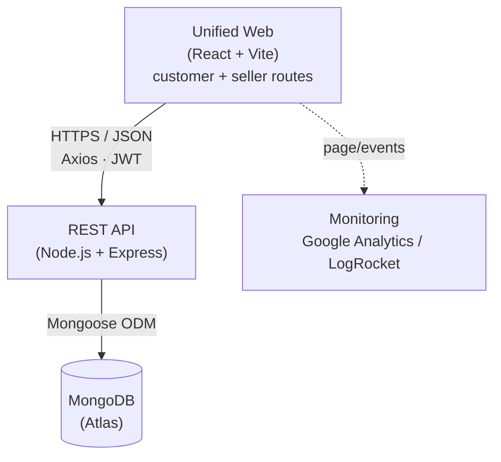
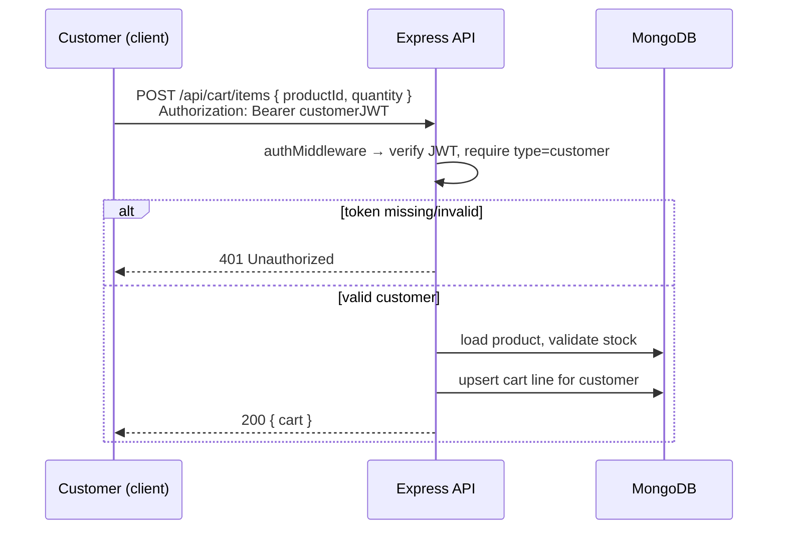
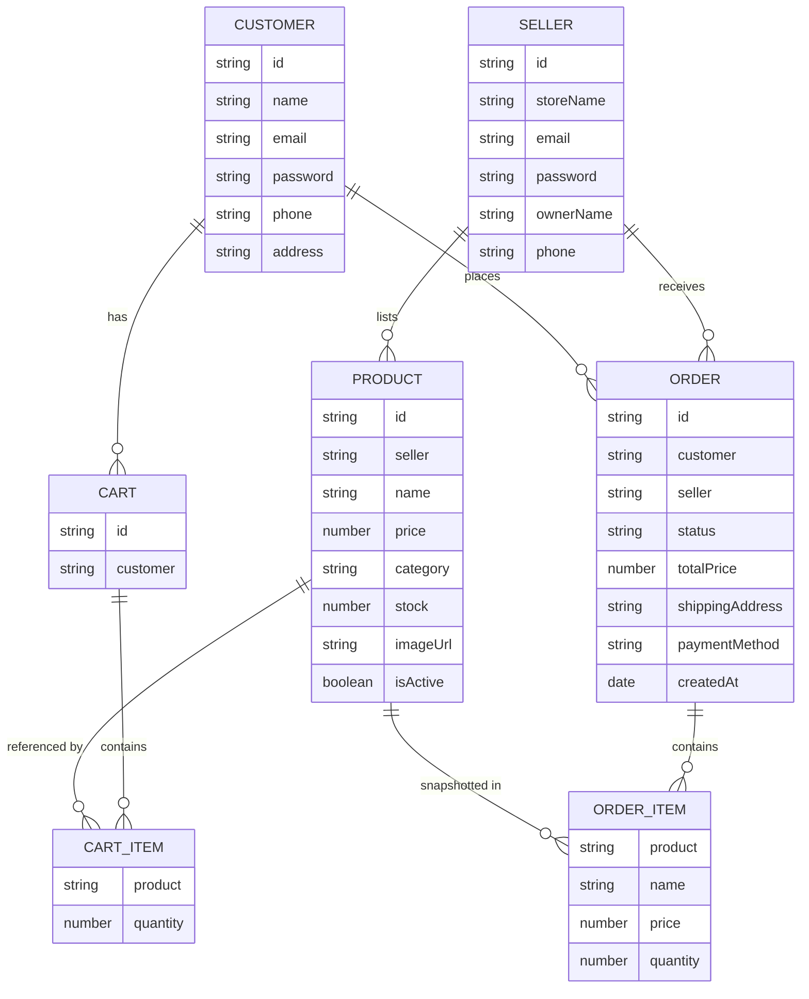
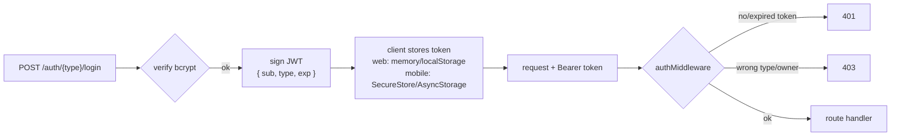
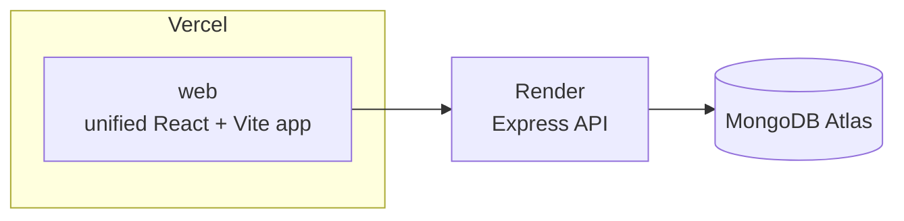

# Technical Requirements Document (TRD)
### Online Marketplace — "Tokopedia-style" Two-Sided Marketplace

| | |
|---|---|
| **Course** | Specialized Platform Development |
| **Deliverable** | Tugas Kelompok Project Lab — Week 10 |
| **Document** | Technical Requirements (Unified web marketplace) |
| **Companion** | `product-requirements.md` |
| **Status** | Draft for review |
| **Date** | 2026-08-01 |

---

## 1. Introduction

This document specifies the **technical design** for the marketplace defined in `product-requirements.md`. It covers system architecture, the shared API, the data model, authentication/authorization, the unified web app, monitoring, and local setup. Mobile clients and public deployment are documented as future work.

The current system is **one unified web application served by one backend**:

1. Customer storefront routes (React + Vite)
2. Seller dashboard routes (React + Vite)

Both route surfaces consume a single **Node.js + Express REST API** backed by **MongoDB**. Native mobile clients can be added later without changing the API contract.

---

## 2. System Architecture



**Design principles**

- **One API, many clients.** Business rules (gated cart, ownership, stock, order lifecycle) live in the API so every client inherits them and cannot bypass them.
- **Stateless auth.** The API keeps no server session; each request carries a JWT. This scales horizontally and works identically for web and mobile.
- **Thin clients.** Clients render, validate for UX, and call the API. Authorization is never trusted from the client.

### 2.1 Request flow (example: gated add-to-cart)



---

## 3. Technology Stack

| Layer | Technology | Notes |
|-------|------------|-------|
| Customer/Seller Web | **React 18 + React Router**, built with **Vite** | Responsive via Flexbox / CSS Grid |
| Mobile (both sides) | React Native + Expo | Deferred; future clients will reuse the API |
| HTTP client | **Axios** (Fetch acceptable) | Shared request/interceptor pattern |
| Backend | **Node.js + Express.js** | RESTful API |
| Database | **MongoDB** (Atlas) + **Mongoose** | Schemas & validation |
| Auth | **JWT** (`jsonwebtoken`) + **bcrypt** | Separate customer/seller identities |
| Validation | **express-validator** (or `zod`) | Server-side input validation |
| Deploy — Web | Vercel (or Netlify) | Deferred public deployment; one web project when enabled |
| Deploy — API | Render (or Heroku) | Deferred public deployment; single service when enabled |
| Deploy — Mobile | Expo (EAS) | Deferred |
| Monitoring | **Google Analytics** or **LogRocket** | On web clients |

> The stack is fixed to match the graded Lab modules. Choose **one** option where alternatives are listed (e.g. Vercel *or* Netlify) and use it consistently.

---

## 4. Suggested Repository Structure

A monorepo keeps the shared API and unified web client discoverable; future mobile clients can be added without changing the current boundaries.

```
marketplace/
├── api/                     # Node.js + Express + Mongoose  (deployed to Render)
│   ├── src/
│   │   ├── models/          # Customer, Seller, Product, Cart, Order
│   │   ├── routes/          # auth, products, cart, orders
│   │   ├── controllers/
│   │   ├── middleware/      # auth (JWT), validation, error handler
│   │   └── app.js
│   └── package.json
├── web/                     # Unified React + Vite app (customer + seller routes)
└── docs/                    # this PRD + TRD + design system
```

---

## 5. Data Model

Separate `customers` and `sellers` collections reflect the **separate-accounts** decision (BR-1). Products belong to a seller; orders reference a customer and snapshot line items.



### 5.1 Collection schemas (Mongoose-style)

**customers**
```js
{
  name:     { type: String, required: true },
  email:    { type: String, required: true, unique: true, lowercase: true },
  password: { type: String, required: true }, // bcrypt hash
  phone:    { type: String },
  address:  { type: String }
}
```

**sellers**
```js
{
  storeName: { type: String, required: true },
  ownerName: { type: String, required: true },
  email:     { type: String, required: true, unique: true, lowercase: true },
  password:  { type: String, required: true }, // bcrypt hash
  phone:     { type: String }
}
```

**products**
```js
{
  seller:     { type: ObjectId, ref: 'Seller', required: true },
  name:       { type: String, required: true },
  description:{ type: String, required: true },
  price:      { type: Number, required: true, min: 0 }, // IDR
  category:   { type: String, required: true },
  stock:      { type: Number, required: true, min: 0 },
  imageUrl:   { type: String }, // URL, not uploaded file
  isActive:   { type: Boolean, default: true },
  images:     [{ type: String }] // legacy records only; normalized to imageUrl on read
}
```

**carts** (one per customer)
```js
{
  customer: { type: ObjectId, ref: 'Customer', required: true, unique: true },
  items: [{ product: { type: ObjectId, ref: 'Product' }, quantity: { type: Number, min: 1 } }]
}
```

**orders** — **one order per seller** (a single checkout may create several; line items are snapshotted — BR-6, BR-7)
```js
{
  customer: { type: ObjectId, ref: 'Customer', required: true },
  seller:   { type: ObjectId, ref: 'Seller', required: true, index: true }, // one seller per order
  items: [{
    product:  { type: ObjectId, ref: 'Product' },
    name:     String,
    price:    Number, // price at time of purchase
    quantity: Number
  }],
  totalPrice:      { type: Number, required: true }, // this seller's sub-total
  status:          { type: String, enum: ['PENDING','PAID','PROCESSED','SHIPPED','COMPLETED','CANCELLED'], default: 'PENDING' },
  shippingAddress: { type: String, required: true },
  paymentMethod:   { type: String, enum: ['COD','Transfer'], required: true }
}
```

> **Why one order per seller?** An order carries a single `status` that its seller advances (BR-3). If one order spanned multiple sellers, seller A marking it `SHIPPED` would wrongly flip the status for seller B's unshipped items and mislead the customer. So checkout **groups the cart by `seller` and creates one order per seller** (BR-7) — the same way Tokopedia splits a checkout into one invoice per store. Each order then has exactly one seller, one clean status, a cheap inbox query (`orders.find({ seller: me })`), and its own sub-total.
>
> **Why snapshot `name` and `price` into each line?** Orders are historical records. If a seller later edits a price or deletes a product, past orders must stay accurate (BR-6).

---

## 6. REST API Specification

Base URL: `/api`. All request/response bodies are JSON. Protected routes require `Authorization: Bearer <JWT>`.

**Legend:** 🔓 public · 🧑 customer token · 🏪 seller token

### 6.1 Authentication (separate customer/seller flows)

| Method | Path | Access | Purpose |
|--------|------|:------:|---------|
| POST | `/api/auth/customer/register` | 🔓 | Create customer account |
| POST | `/api/auth/customer/login` | 🔓 | Customer login → JWT (`type: "customer"`) |
| POST | `/api/auth/seller/register` | 🔓 | Create seller account |
| POST | `/api/auth/seller/login` | 🔓 | Seller login → JWT (`type: "seller"`) |
| GET | `/api/auth/me` | 🧑/🏪 | Return current identity from token |

### 6.2 Products

| Method | Path | Access | Purpose |
|--------|------|:------:|---------|
| GET | `/api/products` | 🔓 | List/browse (query: `?search=&category=&page=`) |
| GET | `/api/products/:id` | 🔓 | Product detail |
| POST | `/api/products` | 🏪 | Seller creates a product (owner = token seller) |
| PUT | `/api/products/:id` | 🏪 | Seller updates **own** product (BR-4) |
| DELETE | `/api/products/:id` | 🏪 | Seller deletes/deactivates **own** product (BR-4) |
| GET | `/api/seller/products` | 🏪 | Seller's own product list (S5) |

### 6.3 Cart — **gated (customer only)**

| Method | Path | Access | Purpose |
|--------|------|:------:|---------|
| GET | `/api/cart` | 🧑 | View current cart |
| POST | `/api/cart/items` | 🧑 | Add item `{ productId, quantity }` (gated — BR-2) |
| PUT | `/api/cart/items/:productId` | 🧑 | Update quantity |
| DELETE | `/api/cart/items/:productId` | 🧑 | Remove line |

> All cart routes return **`401`** without a valid customer token. This is the enforcement point for the "gated add-to-cart" requirement (BR-2) — the UI redirect to login is convenience only.

### 6.4 Orders

| Method | Path | Access | Purpose |
|--------|------|:------:|---------|
| POST | `/api/orders` | 🧑 | Checkout: **group cart by seller → create one order per seller**, decrement stock, empty cart (C6, BR-7). Returns the created order(s). |
| GET | `/api/orders` | 🧑 | Customer's order history — all their per-seller orders (C7) |
| GET | `/api/orders/:id` | 🧑 | Customer order detail |
| GET | `/api/seller/orders` | 🏪 | Seller's orders — `find({ seller: me })` (S6) |
| PUT | `/api/seller/orders/:id/status` | 🏪 | Advance order status per lifecycle (S7, BR-3) |

### 6.5 Response & error conventions

- **Success:** `2xx` with `{ success: true, message, data }`.
- **Validation error:** `400` with `{ error, details: [...] }`.
- **Auth:** `401` (missing/invalid token) vs `403` (valid token, wrong type/owner).
- **Not found:** `404`. **Server:** `500` (never leak stack traces to clients).

---

## 7. Authentication & Authorization



- **JWT payload:** `{ sub: <userId>, type: 'customer' | 'seller', iat, exp }`. Signed with `JWT_SECRET`; expiry (e.g. 7d) configurable.
- **Passwords:** hashed with **bcrypt** (never stored or logged in plaintext).
- **Middleware:**
  - `requireAuth` — verifies token, attaches `req.user`.
  - `requireCustomer` / `requireSeller` — assert `req.user.type` (enforces BR-1).
  - `requireOwnership` — for product/order writes, assert the resource belongs to `req.user.sub` (enforces BR-4).
- **Protected routes (Soal 4):** cart, checkout, order history, profile (customer); all product-write and order routes (seller).
- **Token storage on web:** customer and seller sessions use separate localStorage keys. Future mobile clients should use Expo **SecureStore** (preferred) or **AsyncStorage**.

---

## 8. Frontend Architecture

### 8.1 Customer / Seller Web (React + Vite)

- **Routing (React Router):**
  - Customer routes: `/`, `/products`, `/products/:id`, `/cart` 🔒, `/checkout` 🔒, `/orders` 🔒, `/login`, `/register`.
  - Seller routes: `/seller/login`, `/seller/register`, `/seller/dashboard` 🔒, `/seller/products` 🔒, `/seller/products/new` 🔒, `/seller/products/:id/edit` 🔒, `/seller/orders` 🔒.
  - 🔒 routes are wrapped in a `<ProtectedRoute>` that checks the token and redirects to login (mirroring the API gate).
- **State:** lightweight — React Context for auth/session + cart; component/local state elsewhere. (Redux is optional and not required.)
- **API layer:** customer and seller Axios clients share the same env-driven base URL while reading separate browser session keys; request interceptors attach the Bearer token and response interceptors handle `401`.
- **Responsive (Soal 1):** Flexbox/CSS Grid; product grid collapses to a single column on narrow viewports; no fixed pixel-width layouts.

### 8.2 Future Customer / Seller Mobile (React Native + Expo)

- **Navigation:** React Navigation (stack + tabs).
  - Customer mobile screens: Product List, Product Detail, Login/Register, Order History (+ optional Cart/Checkout).
  - Seller mobile screens: Login/Register, My Products, Add/Edit Product, Orders Inbox, Update Status.
- **API integration:** reuse the same REST paths and Axios pattern; base URL points at the deployed API.
- **Token persistence:** use SecureStore/AsyncStorage; an auth bootstrap on launch restores the session.

### 8.3 Shared client conventions

- Environment-driven API base URL (`VITE_API_URL`; future Expo clients can use `extra.apiUrl`) — never hard-code the deployed host.
- Explicit **loading / empty / error** states on every data screen.
- Client-side validation is for UX only; the API is the source of truth.

---

## 9. Security & Validation

| Concern | Requirement |
|---------|-------------|
| Passwords | bcrypt hashed; minimum length enforced at registration |
| Secrets | `JWT_SECRET`, DB URI, etc. in environment variables — never committed |
| Input validation | Server-side on every write (express-validator/zod): types, required fields, price/stock ≥ 0, enum status values |
| AuthZ | Route-level type checks (customer vs seller) + ownership checks (BR-1, BR-4) |
| Gated cart | Enforced server-side (`401`) independent of UI (BR-2) |
| CORS | Restrict to the configured web origins using `CORS_ORIGINS` |
| Rate limiting | Basic `express-rate-limit` on auth endpoints to blunt brute force |
| Transport | HTTPS everywhere (provided by Vercel/Render) |
| Error hygiene | No stack traces or secrets in client-facing error responses |

---

## 10. Deployment Architecture (Soal 5)



| Artifact | Platform | Output |
|----------|----------|--------|
| Unified Web | Vercel (or Netlify) | Deferred public URL |
| API | Render (or Heroku) | Deferred public HTTPS base URL |
| Database | MongoDB Atlas | Connection URI (env) |
| Mobile (both) | Expo | Deferred |

- **Env-var promotion:** each deployment target holds its own env vars (API holds `MONGODB_URI`, `JWT_SECRET`; web holds `VITE_API_URL` and optional `VITE_GA_ID`).
- **Current milestone:** keep the documented local API and web builds working before choosing a public hosting target.

---

## 11. Monitoring & Analytics (Soal 5)

- **Google Analytics** (GA4) is integrated once on the unified **web** client.
- Track at minimum: page/route views and a key conversion event (e.g. `add_to_cart`, `checkout_completed`).
- Keep the measurement id / app id in env vars; disable in local dev to avoid noise.

---

## 12. Local Development Setup

**Prerequisites:** Node.js LTS, npm/pnpm, a MongoDB Atlas URI (or local MongoDB).

```bash
# 1. API
cd api
cp .env.example .env         # set MONGODB_URI, JWT_SECRET, PORT
npm install
npm run dev                  # http://localhost:4000

# 2. Unified Customer / Seller Web
cd ../web
cp .env.example .env         # set VITE_API_URL=http://localhost:4000/api
npm install
npm run dev                  # http://localhost:5173

# Native mobile clients are deferred for this milestone.
```

### 12.1 Environment variables

| App | Variable | Example |
|-----|----------|---------|
| API | `MONGODB_URI` | `mongodb+srv://…` |
| API | `JWT_SECRET` | `<random-long-string>` |
| API | `PORT` | `4000` |
| API | `CORS_ORIGINS` | `https://marketplace.example.app` |
| Web | `VITE_API_URL` | `https://api.example.com/api` |
| Web | `VITE_GA_ID` / LogRocket id | `G-XXXX` |
| Mobile | `apiUrl` (future Expo `extra`) | `https://api.example.com/api` |

---

## 13. Requirements → Grading Rubric Mapping (Soal 1–5)

| Soal (weight) | Topic | Technical coverage |
|---------------|-------|--------------------|
| **Soal 1 (20%)** | Frontend React Web | §8.1 — React Router, `ProtectedRoute`, responsive Flexbox/Grid, home/list/detail/cart/checkout |
| **Soal 2 (20%)** | Backend Node/Express + MongoDB | §5 data model, §6 REST API, §9 validation — CRUD for products & users with input validation |
| **Soal 3 (20%)** | Mobile React Native | Deferred milestone; §6 REST contracts remain reusable by future Expo apps |
| **Soal 4 (20%)** | Data Integration & Auth | §7 JWT auth, protected routes, ownership/type guards; §8.3 Axios/Fetch integration |
| **Soal 5 (15%)** | Deployment & Monitoring | §11 Google Analytics is implemented; §10 public deployment is deferred |

---

## 14. Open Technical Decisions (to confirm during build)

| # | Decision | Default taken |
|---|----------|---------------|
| D1 | Pagination strategy for product list | Simple `page`/`limit` query params |
| D2 | Payment simulation timing | Implemented: checkout creates each order as `PAID` because payment is simulated |
| D3 | State management on web | React Context (no Redux) unless complexity grows |
| D4 | Multi-seller cart at checkout | Split into **one order per seller** (grouped by `seller`); one combined payment, per-seller orders & statuses (BR-7) |
| D5 | Image handling | `imageUrl` strings only; no upload service |

> These are recorded so they can be revisited without reopening the whole design. Changing one should be a local edit here, not a redesign.
