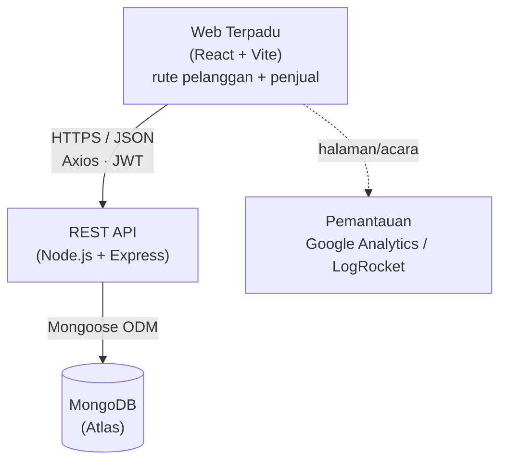
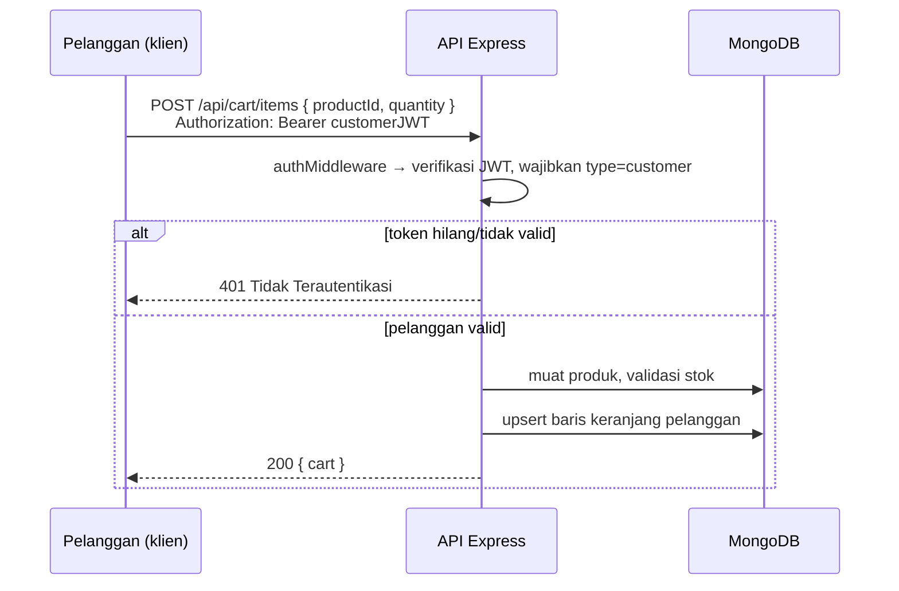
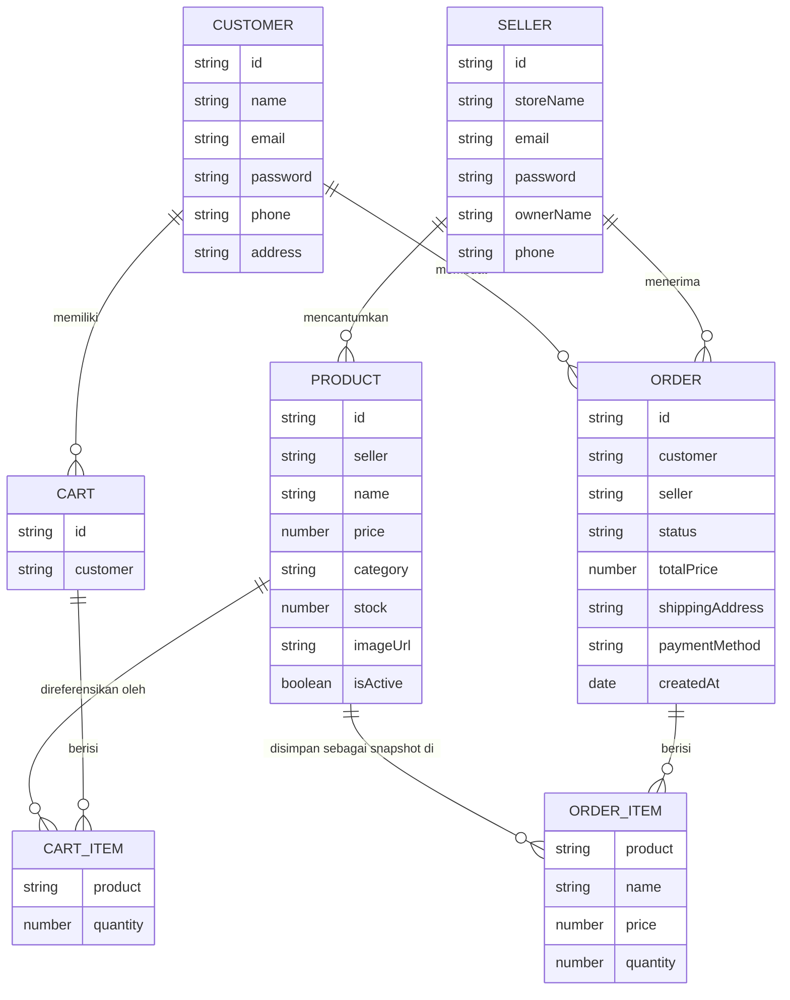
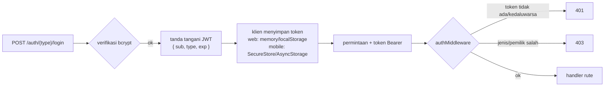
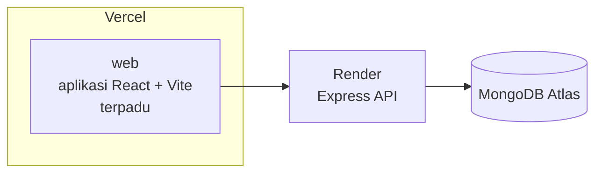

# Dokumen Persyaratan Teknis (TRD)
### Marketplace Daring — Marketplace Dua Sisi "bergaya Tokopedia"

| | |
|---|---|
| **Mata Kuliah** | Pengembangan Platform Khusus |
| **Luaran** | Tugas Kelompok Proyek Lab — Minggu 10 |
| **Dokumen** | Persyaratan Teknis (Marketplace web terpadu) |
| **Dokumen Pendamping** | `product-requirements.md` |
| **Status** | Draf untuk ditinjau |
| **Tanggal** | 2026-08-01 |

---

## 1. Pendahuluan

Dokumen ini menetapkan **rancangan teknis** untuk marketplace yang didefinisikan dalam `product-requirements.md`. Dokumen ini mencakup arsitektur sistem, API bersama, model data, autentikasi/otorisasi, aplikasi web terpadu, pemantauan, dan penyiapan lokal. Klien mobile dan deployment publik didokumentasikan sebagai pekerjaan mendatang.

Sistem saat ini adalah **satu aplikasi web terpadu yang dilayani satu backend**:

1. Rute etalase pelanggan (React + Vite)
2. Rute dasbor penjual (React + Vite)

Kedua permukaan rute menggunakan satu **Node.js + Express REST API** yang didukung **MongoDB**. Klien mobile native dapat ditambahkan kemudian tanpa mengubah kontrak API.

---

## 2. Arsitektur Sistem



**Prinsip desain**

- **Satu API, banyak klien.** Aturan bisnis (keranjang terbatas, kepemilikan, stok, siklus pesanan) berada di API agar setiap klien mewarisinya dan tidak dapat melewatinya.
- **Autentikasi stateless.** API tidak menyimpan sesi server; setiap permintaan membawa JWT. Pola ini dapat diskalakan secara horizontal dan bekerja sama untuk web maupun mobile.
- **Klien tipis.** Klien melakukan render, validasi untuk UX, dan memanggil API. Otorisasi tidak pernah dipercaya dari klien.

### 2.1 Alur permintaan (contoh: penambahan ke keranjang yang dibatasi)



---

## 3. Stack Teknologi

| Lapisan | Teknologi | Catatan |
|-------|------------|-------|
| Web Pelanggan/Penjual | **React 19 + React Router 8**, dibangun dengan **Vite** | Responsif melalui Flexbox / CSS Grid |
| Mobile (kedua sisi) | React Native + Expo | Ditunda; klien mendatang akan menggunakan kembali API |
| Klien HTTP | **Axios** (Fetch dapat digunakan) | Pola request/interceptor bersama |
| Backend | **Node.js + Express.js** | API RESTful |
| Database | **MongoDB** (Atlas) + **Mongoose** | Skema & validasi |
| Autentikasi | **JWT** (`jsonwebtoken`) + **bcrypt** | Identitas pelanggan/penjual terpisah |
| Validasi | **express-validator** (atau `zod`) | Validasi input di sisi server |
| Deployment — Web | Vercel (atau Netlify) | Deployment publik ditunda; satu proyek web saat diaktifkan |
| Deployment — API | Render (atau Heroku) | Deployment publik ditunda; satu layanan saat diaktifkan |
| Deployment — Mobile | Expo (EAS) | Ditunda |
| Pemantauan | **Google Analytics** atau **LogRocket** | Pada klien web |

> Stack ditetapkan agar sesuai dengan modul Lab yang dinilai. Pilih **satu** opsi jika terdapat beberapa alternatif (misalnya Vercel *atau* Netlify) dan gunakan secara konsisten. Klien web menggunakan API deklaratif React Router 8 yang diimpor dari `react-router`.

---

## 4. Struktur Repositori yang Disarankan

Monorepo membuat API bersama dan klien web terpadu mudah ditemukan; klien mobile mendatang dapat ditambahkan tanpa mengubah batasan saat ini.

```
marketplace/
├── api/                     # Node.js + Express + Mongoose  (di-deploy ke Render)
│   ├── src/
│   │   ├── models/          # Pelanggan, Penjual, Produk, Keranjang, Pesanan
│   │   ├── routes/          # auth, products, cart, orders
│   │   ├── controllers/
│   │   ├── middleware/      # autentikasi (JWT), validasi, penangan kesalahan
│   │   └── app.js
│   └── package.json
├── web/                     # Aplikasi React + Vite terpadu (rute pelanggan + penjual)
└── docs/                    # PRD + TRD + sistem desain ini
```

---

## 5. Model Data

Koleksi `customers` dan `sellers` yang terpisah mencerminkan keputusan **akun terpisah** (BR-1). Produk dimiliki oleh penjual; pesanan merujuk pada pelanggan dan menyimpan snapshot item baris.



### 5.1 Skema koleksi (gaya Mongoose)

**customers**
```js
{
  name:     { type: String, required: true },
  email:    { type: String, required: true, unique: true, lowercase: true },
  password: { type: String, required: true }, // hash bcrypt
  phone:    { type: String },
  address:  { type: String }
}
```

**sellers**
```js
{
  storeName: { type: String, required: true },
  ownerName: { type: String, required: true },
  email:     { type: String, required: true, unique: true, lowercase: true },
  password:  { type: String, required: true }, // bcrypt hash
  phone:     { type: String }
}
```

**products**
```js
{
  seller:     { type: ObjectId, ref: 'Seller', required: true },
  name:       { type: String, required: true },
  description:{ type: String, required: true },
  price:      { type: Number, required: true, min: 0 }, // IDR
  category:   { type: String, required: true },
  stock:      { type: Number, required: true, min: 0 },
  imageUrl:   { type: String, required: true }, // URL HTTP(S), bukan file yang diunggah
  isActive:   { type: Boolean, default: true },
  images:     [{ type: String }] // hanya rekaman lama; dinormalisasi menjadi imageUrl saat dibaca
}
```

**carts** (satu per pelanggan)
```js
{
  customer: { type: ObjectId, ref: 'Customer', required: true, unique: true },
  items: [{ product: { type: ObjectId, ref: 'Product' }, quantity: { type: Number, min: 1 } }]
}
```

**orders** — **satu pesanan per penjual** (satu checkout dapat membuat beberapa pesanan; item baris dibuat sebagai snapshot — BR-6, BR-7)
```js
{
  customer: { type: ObjectId, ref: 'Customer', required: true },
  seller:   { type: ObjectId, ref: 'Seller', required: true, index: true }, // satu penjual per pesanan
  items: [{
    product:  { type: ObjectId, ref: 'Product' },
    name:     String,
    price:    Number, // harga saat pembelian
    quantity: Number
  }],
  totalPrice:      { type: Number, required: true }, // subtotal penjual ini
  status:          { type: String, enum: ['PENDING','PAID','PROCESSED','SHIPPED','COMPLETED','CANCELLED'], default: 'PENDING' },
  shippingAddress: { type: String, required: true },
  paymentMethod:   { type: String, enum: ['COD','Transfer'], required: true }
}
```

> **Mengapa satu pesanan per penjual?** Pesanan memiliki satu `status` yang dimajukan oleh penjualnya (BR-3). Jika satu pesanan mencakup beberapa penjual, penjual A yang menandainya sebagai `SHIPPED` akan keliru mengubah status item penjual B yang belum dikirim dan menyesatkan pelanggan. Karena itu, checkout **mengelompokkan keranjang berdasarkan `seller` dan membuat satu pesanan per penjual** (BR-7) — sama seperti Tokopedia membagi checkout menjadi satu faktur per toko. Setiap pesanan kemudian memiliki tepat satu penjual, satu status yang jelas, kueri kotak masuk yang murah (`orders.find({ seller: me })`), dan subtotalnya sendiri.
>
> **Mengapa membuat snapshot `name` dan `price` di setiap baris?** Pesanan adalah rekaman historis. Jika penjual kemudian mengubah harga atau menghapus produk, pesanan sebelumnya harus tetap akurat (BR-6).

---

## 6. Spesifikasi REST API

URL dasar: `/api`. Semua body permintaan/respons adalah JSON. Rute terlindungi memerlukan `Authorization: Bearer <JWT>`.

**Legenda:** 🔓 publik · 🧑 token pelanggan · 🏪 token penjual

### 6.1 Autentikasi (alur pelanggan/penjual terpisah)

| Metode | Path | Akses | Tujuan |
|--------|------|:------:|---------|
| POST | `/api/auth/customer/register` | 🔓 | Buat akun pelanggan |
| POST | `/api/auth/customer/login` | 🔓 | Login pelanggan → JWT (`type: "customer"`) |
| POST | `/api/auth/seller/register` | 🔓 | Buat akun penjual |
| POST | `/api/auth/seller/login` | 🔓 | Login penjual → JWT (`type: "seller"`) |
| GET | `/api/auth/me` | 🧑/🏪 | Kembalikan identitas saat ini dari token |

### 6.2 Produk

| Metode | Path | Akses | Tujuan |
|--------|------|:------:|---------|
| GET | `/api/products` | 🔓 | Daftar/jelajah (kueri: `?search=&category=&page=`) |
| GET | `/api/products/:id` | 🔓 | Detail produk |
| POST | `/api/products` | 🏪 | Penjual membuat produk (pemilik = penjual pada token) |
| PUT | `/api/products/:id` | 🏪 | Penjual memperbarui produk **miliknya sendiri** (BR-4) |
| DELETE | `/api/products/:id` | 🏪 | Penjual menghapus/menonaktifkan produk **miliknya sendiri** (BR-4) |
| GET | `/api/seller/products` | 🏪 | Daftar produk milik penjual (S5) |

### 6.3 Keranjang — **dibatasi (khusus pelanggan)**

| Metode | Path | Akses | Tujuan |
|--------|------|:------:|---------|
| GET | `/api/cart` | 🧑 | Lihat keranjang saat ini |
| POST | `/api/cart/items` | 🧑 | Tambahkan item `{ productId, quantity }` (dibatasi — BR-2) |
| PUT | `/api/cart/items/:productId` | 🧑 | Perbarui kuantitas |
| DELETE | `/api/cart/items/:productId` | 🧑 | Hapus baris |

> Semua rute keranjang mengembalikan **`401`** tanpa token pelanggan yang valid. Inilah titik pemberlakuan persyaratan "gated add-to-cart" (BR-2) — pengalihan UI ke login hanya merupakan kemudahan.

### 6.4 Pesanan

| Metode | Path | Akses | Tujuan |
|--------|------|:------:|---------|
| POST | `/api/orders` | 🧑 | Checkout: **kelompokkan keranjang berdasarkan penjual → buat satu pesanan per penjual**, kurangi stok secara atomik dan kosongkan keranjang dalam transaksi MongoDB (C6, BR-7). Kembalikan pesanan yang dibuat. |
| GET | `/api/orders` | 🧑 | Riwayat pesanan pelanggan — semua pesanan per penjual miliknya (C7) |
| GET | `/api/orders/:id` | 🧑 | Detail pesanan pelanggan |
| GET | `/api/seller/orders` | 🏪 | Pesanan penjual — `find({ seller: me })` (S6) |
| PUT | `/api/seller/orders/:id/status` | 🏪 | Majukan status pesanan sesuai siklus (S7, BR-3) |

### 6.5 Konvensi respons & kesalahan

- **Berhasil:** `2xx` dengan `{ success: true, message, data }`.
- **Kesalahan validasi:** `400` dengan `{ error, details: [...] }`.
- **Autentikasi:** `401` (token tidak ada/tidak valid) vs `403` (token valid, jenis/pemilik salah).
- **Tidak ditemukan:** `404`. **Server:** `500` (jangan pernah membocorkan stack trace kepada klien).
- Respons pesanan penjual menyertakan `allowedTransitions`, yang dihitung oleh API berdasarkan siklus pesanan; klien tidak boleh menyimpulkan perubahan status yang diizinkan secara lokal.

---

## 7. Autentikasi & Otorisasi



- **Payload JWT:** `{ sub: <userId>, type: 'customer' | 'seller', iat, exp }`. Ditandatangani dengan `JWT_SECRET`; masa berlaku (misalnya 7d) dapat dikonfigurasi.
- **Password:** di-hash dengan **bcrypt** (tidak pernah disimpan atau dicatat dalam teks biasa).
- **Middleware:**
  - `requireAuth` — memverifikasi token dan memasang `req.user`.
  - `requireCustomer` / `requireSeller` — memastikan `req.user.type` (memberlakukan BR-1).
  - `requireOwnership` — untuk penulisan produk/pesanan, memastikan sumber daya dimiliki `req.user.sub` (memberlakukan BR-4).
- **Rute terlindungi (Soal 4):** keranjang, checkout, riwayat pesanan, profil (pelanggan); semua rute penulisan produk dan pesanan (penjual).
- **Penyimpanan token di web:** sesi pelanggan dan penjual menggunakan kunci localStorage yang terpisah. Klien mobile mendatang harus menggunakan Expo **SecureStore** (diutamakan) atau **AsyncStorage**.

---

## 8. Arsitektur Frontend

### 8.1 Web Pelanggan / Penjual (React + Vite)

- **Routing (React Router):**
  - Rute pelanggan: `/`, `/products`, `/products/:id`, `/cart` 🔒, `/checkout` 🔒, `/orders` 🔒, `/login`, `/register`.
  - Rute penjual: `/seller/login`, `/seller/register`, `/seller/dashboard` 🔒, `/seller/products` 🔒, `/seller/products/new` 🔒, `/seller/products/:id/edit` 🔒, `/seller/orders` 🔒.
  - Rute 🔒 dibungkus dalam `<ProtectedRoute>` yang memeriksa token dan mengarahkan ke login (meniru pembatasan API).
- **State:** ringan — React Context untuk autentikasi/sesi + keranjang; state komponen/lokal digunakan di tempat lain. (Redux bersifat opsional dan tidak wajib.)
- **Lapisan API:** klien Axios pelanggan dan penjual menggunakan URL dasar yang sama dari env, sambil membaca kunci sesi browser yang terpisah; interceptor permintaan memasang token Bearer dan interceptor respons menangani `401`.
- **Responsif (Soal 1):** Flexbox/CSS Grid; grid produk menjadi satu kolom pada viewport sempit; tidak ada tata letak dengan lebar piksel tetap.

### 8.2 Mobile Pelanggan / Penjual Mendatang (React Native + Expo)

- **Navigasi:** React Navigation (stack + tabs).
  - Layar mobile pelanggan: Daftar Produk, Detail Produk, Masuk/Daftar, Riwayat Pesanan (+ Keranjang/Checkout opsional).
  - Layar mobile penjual: Masuk/Daftar, Produk Saya, Tambah/Edit Produk, Kotak Masuk Pesanan, Perbarui Status.
- **Integrasi API:** gunakan kembali path REST dan pola Axios yang sama; URL dasar mengarah ke API yang di-deploy.
- **Persistensi token:** gunakan SecureStore/AsyncStorage; bootstrap autentikasi saat peluncuran memulihkan sesi.

### 8.3 Konvensi klien bersama

- Base URL API yang digerakkan oleh environment (`VITE_API_URL`; klien Expo mendatang dapat menggunakan `extra.apiUrl`) — jangan pernah menulis host yang di-deploy secara hard-code.
- Keadaan **memuat / kosong / kesalahan** yang eksplisit pada setiap layar data.
- Validasi di sisi klien hanya untuk UX; API adalah sumber kebenaran.

---

## 9. Keamanan & Validasi

| Aspek | Persyaratan |
|---------|-------------|
| Password | Di-hash dengan bcrypt; panjang minimum diberlakukan saat pendaftaran |
| Rahasia | `JWT_SECRET`, URI DB, dll. dalam variabel lingkungan — tidak pernah di-commit |
| Validasi input | Di sisi server pada setiap penulisan (express-validator/zod): tipe, field wajib, price/stock ≥ 0, nilai status enum |
| AuthZ | Pemeriksaan jenis di tingkat rute (pelanggan vs penjual) + pemeriksaan kepemilikan (BR-1, BR-4) |
| Keranjang terbatas | Diberlakukan di sisi server (`401`) secara independen dari UI (BR-2) |
| CORS | Batasi ke origin web yang dikonfigurasi menggunakan `CORS_ORIGINS` |
| Pembatasan laju | `express-rate-limit` dasar pada endpoint autentikasi untuk meredam brute force |
| Transport | HTTPS di semua tempat (disediakan oleh Vercel/Render) |
| Kebersihan kesalahan | Tidak ada stack trace atau rahasia dalam respons kesalahan yang ditujukan kepada klien |

---

## 10. Arsitektur Deployment (Soal 5)



| Artefak | Platform | Keluaran |
|----------|----------|--------|
| Web Terpadu | Vercel (atau Netlify) | URL publik ditunda |
| API | Render (atau Heroku) | Base URL HTTPS publik ditunda |
| Database | MongoDB Atlas | URI koneksi (env) |
| Mobile (keduanya) | Expo | Ditunda |

- **Promosi env-var:** setiap target deployment memiliki env var sendiri (API menyimpan `MONGODB_URI`, `JWT_SECRET`; web menyimpan `VITE_API_URL` dan `VITE_GA_ID` opsional).
- **Milestone saat ini:** pastikan build API dan web lokal yang didokumentasikan tetap berfungsi sebelum memilih target hosting publik.

---

## 11. Pemantauan & Analitik (Soal 5)

- **Google Analytics** (GA4) diintegrasikan satu kali pada klien **web** terpadu.
- Setidaknya lacak: tampilan halaman/rute dan satu event konversi utama (misalnya `add_to_cart`, `checkout_completed`).
- Simpan measurement id / app id dalam env var; nonaktifkan saat pengembangan lokal untuk menghindari noise.

---

## 12. Penyiapan Pengembangan Lokal

**Prasyarat:** Node.js 22.22.0 atau lebih baru, npm/pnpm, serta URI MongoDB Atlas atau replica set MongoDB lokal. Transaksi checkout memerlukan MongoDB yang mendukung transaksi.

```bash
# 1. API
cd api
cp .env.example .env         # set MONGODB_URI, JWT_SECRET, PORT
npm install
npm run dev                  # http://localhost:4000

# 2. Web Pelanggan / Penjual Terpadu
cd ../web
cp .env.example .env         # set VITE_API_URL=http://localhost:4000/api
npm install
npm run dev                  # http://localhost:5173

# Atau, dari root repositori setelah menginstal dependensi setiap aplikasi:
# npm install
# npm --prefix api install
# npm --prefix web install
# npm run dev                  # menjalankan API dan web bersamaan

# Klien mobile native ditunda untuk milestone ini.
```

### 12.1 Variabel lingkungan

| Aplikasi | Variabel | Contoh |
|-----|----------|---------|
| API | `MONGODB_URI` | `mongodb+srv://…` |
| API | `JWT_SECRET` | `<random-long-string>` |
| API | `PORT` | `4000` |
| API | `CORS_ORIGINS` | `https://marketplace.example.app` |
| Web | `VITE_API_URL` | `https://api.example.com/api` |
| Web | `VITE_GA_ID` / id LogRocket | `G-XXXX` |
| Mobile | `apiUrl` (Expo `extra` mendatang) | `https://api.example.com/api` |

---

## 13. Persyaratan → Pemetaan Rubrik Penilaian (Soal 1–5)

| Soal (bobot) | Topik | Cakupan teknis |
|---------------|-------|--------------------|
| **Soal 1 (20%)** | Frontend Web React | §8.1 — React Router, `ProtectedRoute`, Flexbox/Grid responsif, beranda/daftar/detail/keranjang/checkout |
| **Soal 2 (20%)** | Backend Node/Express + MongoDB | model data §5, REST API §6, validasi §9 — CRUD produk & pengguna dengan validasi input |
| **Soal 3 (20%)** | Mobile React Native | Milestone ditunda; kontrak REST §6 tetap dapat digunakan kembali oleh aplikasi Expo mendatang |
| **Soal 4 (20%)** | Integrasi Data & Autentikasi | autentikasi JWT §7, rute terlindungi, penjaga kepemilikan/jenis; integrasi Axios/Fetch §8.3 |
| **Soal 5 (15%)** | Deployment & Pemantauan | Google Analytics §11 diimplementasikan; deployment publik §10 ditunda |

---

## 14. Keputusan Teknis Terbuka (untuk dikonfirmasi selama pembangunan)

| # | Keputusan | Default yang dipilih |
|---|----------|---------------|
| D1 | Strategi paginasi untuk daftar produk | Parameter kueri `page`/`limit` sederhana |
| D2 | Waktu simulasi pembayaran | Diimplementasikan: checkout membuat setiap pesanan sebagai `PAID` karena pembayaran disimulasikan |
| D3 | Manajemen state di web | React Context (tanpa Redux) kecuali kompleksitas meningkat |
| D4 | Keranjang multi-penjual saat checkout | Dipecah menjadi **satu pesanan per penjual** (dikelompokkan berdasarkan `seller`); satu pembayaran gabungan, pesanan & status per penjual (BR-7) |
| D5 | Penanganan gambar | Hanya string `imageUrl`; tanpa layanan unggah |

> Keputusan ini dicatat agar dapat ditinjau kembali tanpa membuka ulang keseluruhan desain. Perubahan pada salah satunya seharusnya cukup berupa pengeditan lokal di sini, bukan desain ulang.
